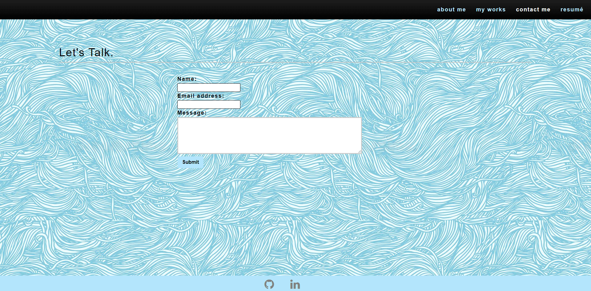

# React-Portfolio

## Description

A professional portfolio created using ReactJS.

**Link to Github repository:** [https://github.com/aldrinburgos18/react-portfolio](https://github.com/aldrinburgos18/react-portfolio)  
**Link to Deployed Application:** [https://aldrinburgos18.github.io/react-portfolio](https://aldrinburgos18.github.io/react-portfolio/)

## Table of Contents

- [Installation](#installation)
- [Screenshots](#screenshots)
- [Contributing](#contributing)
- [Questions](#questions)
- [License](#license)

## Installation

No installation needed.

## Screenshots

The 'About Me' page shows on first visit.  

'My Works' tab shows recent projects created.  

'Contact Me' tab lets users send messages to me.  

'Resume' displays skills I have acquired.  

## Contributing

When contributing to this repository, please first discuss the change you wish to make via issue, email, or any other method with the owners of this repository before making a change.

## Questions

If you have any additional questions, please feel free to contact me at:  
E-mail: burgos.aldrin@gmail.com  
Github: [aldrinburgos18](https://github.com/aldrinburgos18)

## License

  
A short and simple permissive license with conditions only requiring preservation of copyright and license notices. Licensed works, modifications, and larger works may be distributed under different terms and without source code.  
_[More Information about this license...](https://opensource.org/licenses/MIT)_
